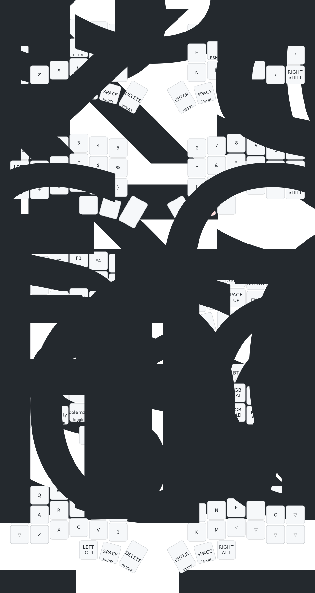

# Clover - Corne V3

ZMK config and relevant files for my custom built split mechanical keyboard.

This board is based on a popular split keyboard PCB shape called the Corne ([github.com/crkbd](https://github.com/foostan/crkbd)), which features 3x6 column staggered keys and 3 thumb keys on each side. It has 4 software layers to access all the keys of a normal board as well as some custom macros. The main advantage of this design is that your fingers never need to leave the home row, meaning you can type faster and more comfortably, along with the massive benefit of being able to make more effective use of keyboard shortcuts. Being split, it also allows your arms to fall more naturally on the table - wherever you like. My(and some others) feeling is that all these seemingly insignificant tweaks add up to a decent improvement in efficiency and comfort over years spent typing.

#### Components

- `MCU`: nice!nano v2 _compatible board_ (wireless)
- `PCB`: Standard [v3.0.1 Cherry-Corne](https://github.com/foostan/crkbd/blob/main/docs/corne-cherry/v3/buildguide_en.md) designs
- `Case`: Corne v3 compatible case
- `OLED`: 0.91" 128x32 I2C white OLEDS
- `Batteries`: 110mah Lipo
- `Sockets`: Hotswap sockets
- `Diodes`: 1N4148W SMD Diode SOD-123
- `Switches`: [Akko V3 Lavender Purple Pro](https://en.akkogear.com/product/akko-v3-lavender-purple-pro-switch-45pcs) | Tactile
- `Keycaps`: PBT Blank Keycap 1U

#### Software

MCU's flashed with official [ZMK firmware](https://github.com/zmkfirmware/zmk)

#### Keymap:

## Images

|           Corne v3            |               .               |
| :---------------------------: | :---------------------------: |
|  |  |
|  |  |
